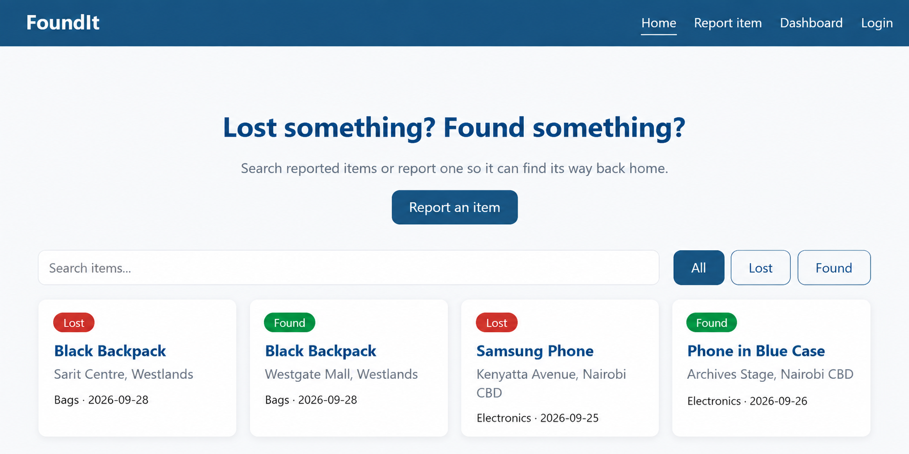

# FoundIt - Lost & Found App

## Description
FoundIt is a Single Page Application (SPA) built with React that helps people report, search for and recover lost items.

The application provides a central platform for lost and found reports instead of relying on scattered WhatsApp groups, social media posts, word of mouth or physical lost-and-found offices.

FoundIt also helps users identify possible matches between lost and found reports by comparing details such as item category, date, location and description. Users can view possible matching items and submit private ownership verification details when claiming a found item.

Phase 1 is frontend-only and uses mock data.

## Screenshot
 

## Features
- Browse reported lost and found items
- Search and filter item reports
- Report a lost or found item
- View full item details on a dedicated details page
- Find possible matches for active lost items
- Rank stronger possible matches first
- View possible matching found items
- Submit a claim for an active found item
- Provide private ownership verification details when making a claim
- Display confirmation after a claim is submitted
- Display an empty state when no possible matches are found
- Navigate between pages without reloading the application

## How Possible Matching Works
FoundIt uses rule-based matching to identify possible matches between lost and found reports.

The matching process considers:
- Item category
- Date proximity
- Location proximity
- Keywords from the item name and description

Only active reports that meet the matching criteria are considered. Stronger possible matches are displayed first.

A possible match does not automatically confirm that two reports refer to the same item. A user must still provide private ownership verification details when claiming a found item.

## Pages and Routes

| Route | Page |
|---|---|
| `/` | Home - browse, search and filter items |
| `/report` | Report a lost or found item |
| `/items/:id` | View item details, possible matches or claim an item |
| `/dashboard` | User dashboard |
| `/login` | Login / register |
| `*` | Not Found page |

## How to Run the Project

1. Clone the repository:

```bash
git clone git@github.com:trizahn2002-source/foundit.git
```

2. Navigate into the project folder:

```bash
cd foundit
```

3. Install dependencies:

```bash
npm install
```

4. Copy the environment file:

```bash
cp .env.example .env
```

5. Add your Geoapify API key to the `.env` file.

6. Start the development server:

```bash
npm run dev
```

7. Open the local URL displayed in the terminal.

## Technologies Used
- React
- React Router DOM
- Vite
- JavaScript
- CSS3
- Geoapify Geocoding API
- Git and GitHub

## API Used
FoundIt uses the Geoapify Geocoding API for location functionality when reporting items.

The API key should be stored in the `.env` file and should not be committed to GitHub.

## Future Implementations
- Connect the application to a backend and database
- Add full user authentication
- Store reports and submitted claims permanently
- Allow finders to review and approve ownership claims
- Notify users when new possible matches are found
- Add image upload and storage
- Improve the matching system as more reports are added

## Collaborators
- [Trizah Njeri](https://github.com/trizahn2002-source) — Scrum Master, Home Page, Search and Filtering
- [Abigail Tandiwe](https://github.com/tandisimelane-15) — Possible Matches and Claim Item
- [Samuel Mwaura](GitHub-link) — Report Item Form and Geoapify API
- [Regan Njeru](https://github.com/toshregan94-hub) — Item Details
- [Wesley Were](GitHub-link) — Login, Registration and Dashboard

## How to Contribute
1. Create a feature branch for your task
2. Make and test your changes
3. Commit your changes with a clear commit message
4. Push your branch to GitHub
5. Open a pull request to merge your changes into `main`

Pull requests are welcome. For major changes, please open an issue first.

## License
MIT License

Copyright (c) 2026 FoundIt Contributors

Permission is hereby granted, free of charge, to any person obtaining a copy
of this software and associated documentation files (the "Software"), to deal
in the Software without restriction, including without limitation the rights
to use, copy, modify, merge, publish, distribute, sublicense, and/or sell
copies of the Software, and to permit persons to whom the Software is
furnished to do so, subject to the following conditions:

The above copyright notice and this permission notice shall be included in all
copies or substantial portions of the Software.

THE SOFTWARE IS PROVIDED "AS IS", WITHOUT WARRANTY OF ANY KIND, EXPRESS OR
IMPLIED, INCLUDING BUT NOT LIMITED TO THE WARRANTIES OF MERCHANTABILITY,
FITNESS FOR A PARTICULAR PURPOSE AND NONINFRINGEMENT. IN NO EVENT SHALL THE
AUTHORS OR COPYRIGHT HOLDERS BE LIABLE FOR ANY CLAIM, DAMAGES OR OTHER
LIABILITY, WHETHER IN AN ACTION OF CONTRACT, TORT OR OTHERWISE, ARISING FROM,
OUT OF OR IN CONNECTION WITH THE SOFTWARE OR THE USE OR OTHER DEALINGS IN THE
SOFTWARE.